# Contento

CONTENTO helps you save videos, tweets, articles from anywhere and send you reminders to read, watch or listem to them when you want.

Authentication

<p>
  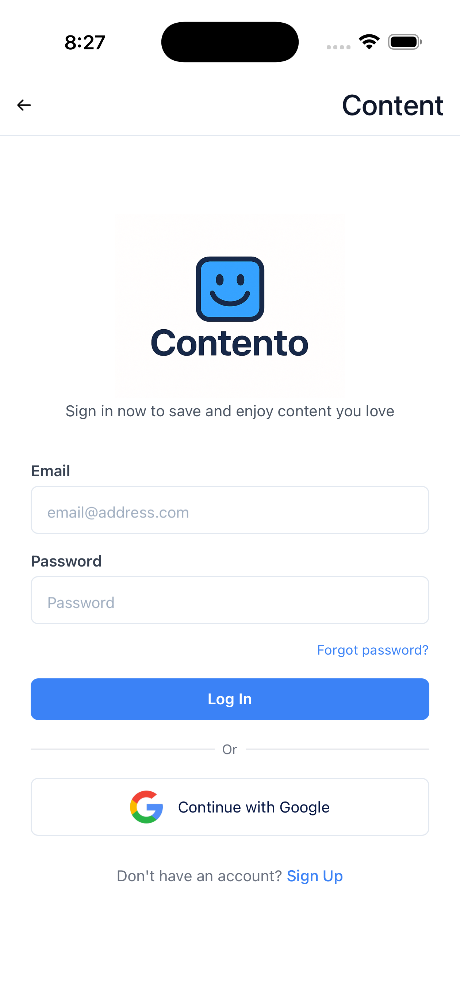
  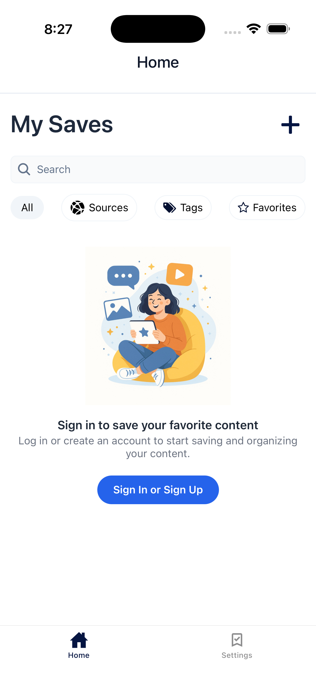
</p>

See All Your Saved Contents

<p>
  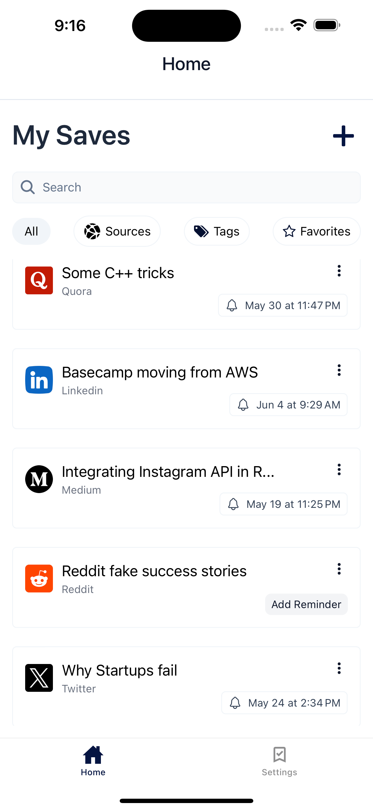
  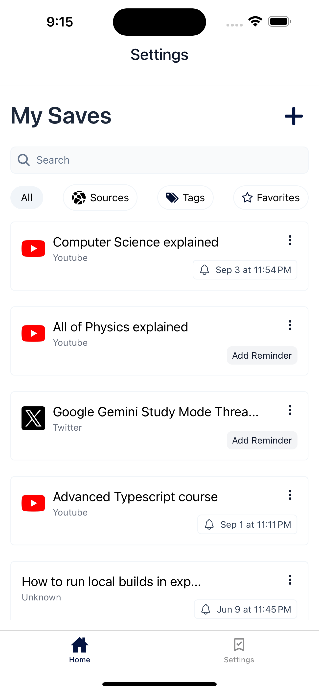
</p>

Adding Content

<p>
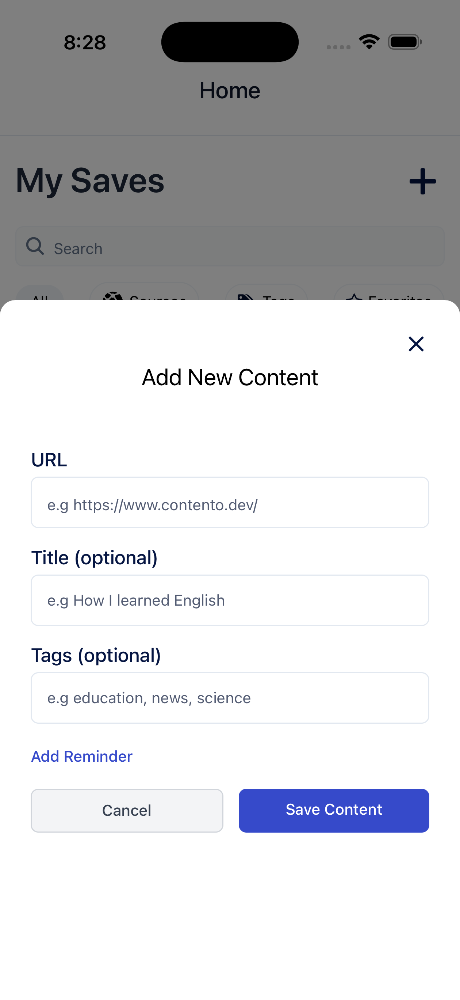
</p>

Auto Share from Any Source in One Click

<p>
  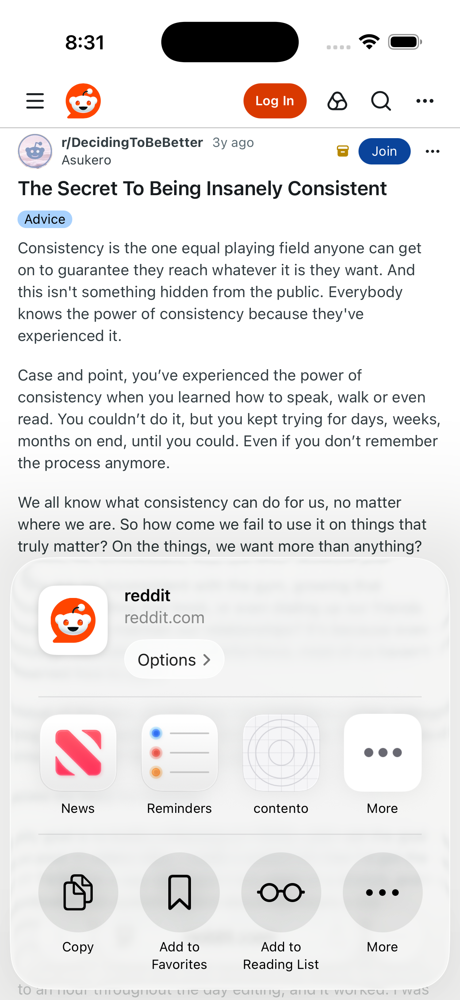
</p>

Filter contents By Source

<p>
  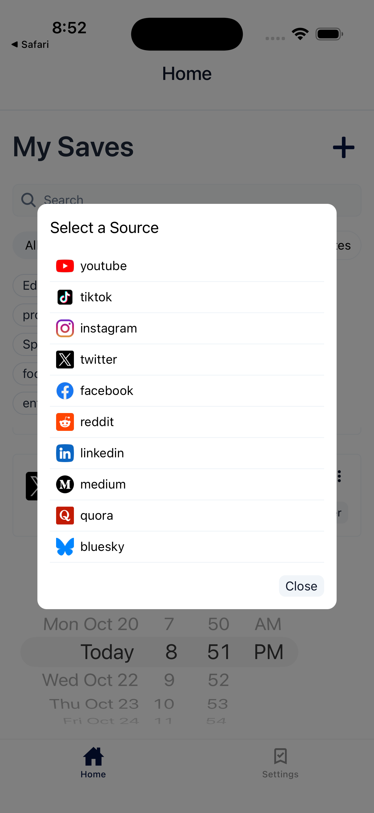
</p>

Reddit Post

<p>
  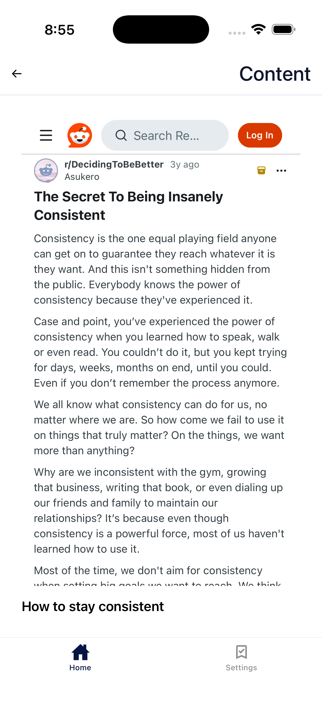
</p>

Youtube Post

<p>
  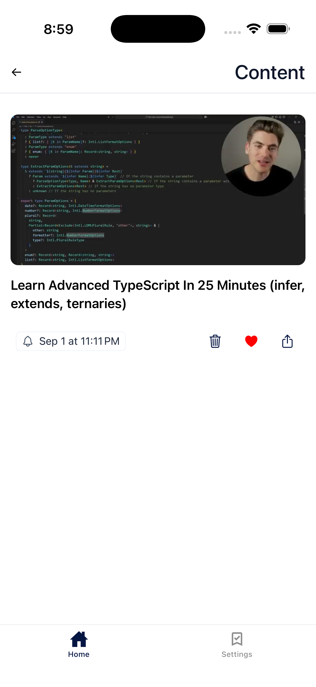
</p>

Add Reminder

<p>
  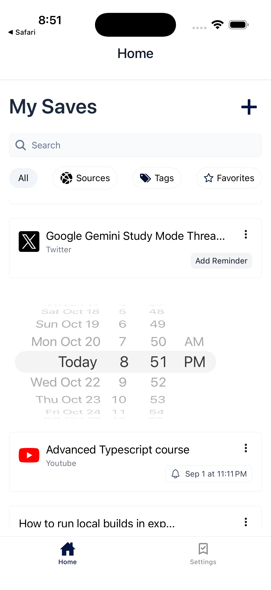
</p>

Settings

<p>
  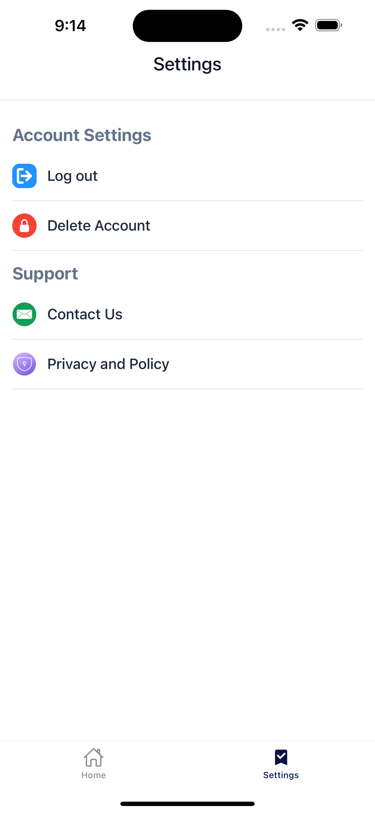
</p>

## 📱 Features

- **Content Sharing**: Save videos, tweets and articles, directly from other apps
- **Google Sign-In**: Secure authentication with Google OAuth
- **Push Notifications**: Real-time notifications to keep users engaged
- **Video & Media Support**: Embedded YouTube videos and rich media content
- **Tweet Embeds**: Display Twitter/X content natively in the app
- **Cross-Platform**: Built for iOS, Android, and Web
- **Modern UI**: Styled with NativeWind (TailwindCSS for React Native)
- **Offline Support**: AsyncStorage for local data persistence
- **Share Extension**: iOS and Android share sheet integration

## 🚀 Tech Stack

- **Framework**: Expo SDK 53 with New Architecture enabled
- **Navigation**: Expo Router (file-based routing)
- **Backend**: Supabase
- **Authentication**: Google Sign-In, Supabase Auth
- **State Management**: TanStack React Query
- **Styling**: NativeWind (TailwindCSS)
- **Media**: React Native Video, YouTube iFrame
- **Notifications**: Expo Notifications

## 📋 Prerequisites

- Node.js 18+ and npm/yarn
- Expo CLI
- iOS Simulator (for iOS development) or Xcode
- Android Studio (for Android development)
- Supabase account
- Google Cloud Console project (for OAuth)

## 🛠️ Installation

1. **Clone the repository**

```bash
git clone https://github.com/Lovenson2000/contento.git
cd contento
```

2. **Install dependencies**

```bash
npm install
# or
yarn install
```

3. **Install patches**

```bash
npm run postinstall
```

4. **Set up environment variables**
   Create a `.env` file in the root directory:

```env
YOUTUBE_API_KEY=your_youtube_api_key
SUPABASE_URL=your_supabase_url
SUPABASE_ANON_KEY=your_supabase_anon_key
GOOGLE_WEB_CLIENT_ID=your_google_web_client_id
```

5. **Run the app**

```bash
# Start development server
npx expo start

# Run on iOS
npx expo run:ios

# Run on Android
npx expo run:android


## 📦 Project Structure

```

contento/
├── app/ # Expo Router pages
├── assets/ # Images, fonts, and static files
│ └── images/
│ ├── icon.png
│ ├── adaptive-icon.png
│ ├── splash-icon.png
│ └── logo.jpg
├── components/ # Reusable components
├── constants/ # App constants and configuration
├── hooks/ # Custom React hooks
├── scripts/ # Build and utility scripts
├── app.json # Expo configuration
├── package.json # Dependencies
└── tsconfig.json # TypeScript configuration

````

## 🔧 Configuration

### iOS Setup

## 🏗️ Building

```bash
# Build for iOS
eas build --platform ios

# Build for Android
eas build --platform android

# Build for both platforms
eas build --platform all
````

## 📱 Platform Support

- ✅ iOS (iPhone & iPad)
- ✅ Android
- ✅ Web (Metro bundler with static output)

## 🎨 Styling

The app uses **NativeWind** for styling, which brings TailwindCSS utility classes to React Native. Style components using className props:

```jsx
<View className="flex-1 bg-white p-4">
  <Text className="text-2xl font-bold text-gray-900">Welcome to Contento</Text>
</View>
```

## 🔔 Push Notifications

Push notifications are configured with:

- Custom notification icon (`logo.jpg`)
- White color scheme
- Background remote notifications enabled

## 📄 License

This project is private and proprietary.

## 👨‍💻 Developer

**Lovenson** - [GitHub Profile]

## 🤝 Contributing

This is a private project. Contributions are not currently accepted.

## 📞 Support

For issues and questions, please contact the development team.
beaucicotlovenson@gmail.com

---

**EAS Project ID**: `7dda0cc0-6209-4911-bb1b-5ded06254925`

Built by Lovenson Beaucicot
